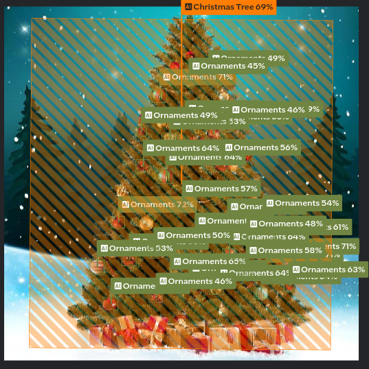
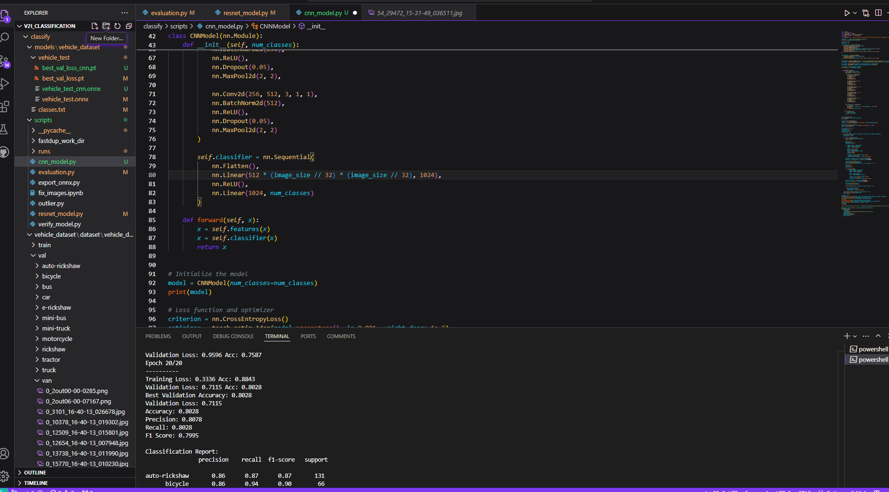

# Dorra

## Overview

This project introduces a pipeline for detecting objects in images and generating detailed descriptions based on user-provided context. By leveraging advanced AI tools and models, we have developed an end-to-end solution for annotation, testing, and deployment. The pipeline simplifies the image processing workflow and ensures high-quality outputs.

## Input Image

## Result

## Features

1. **Context and Image-Based Detection and Description**:

   - The model detects objects in the image and combines them with user-provided context to generate comprehensive descriptions.

2. **Automated Image Installation Pipeline**:

   - Users can provide prompts to automatically install and process images through the pipeline.

3. **Annotation with Intel Geti**:

   - Intel Geti was utilized for annotating images, testing the models, and fine-tuning performance.

   

4. **Deployment with OpenVINO**:

   - The pipeline deploys the trained model using OpenVINO, ensuring optimized inference performance.

5. **Hugging Face Integration**:
   - Hugging Face's Llava v-1.57B model is integrated for generating detailed image descriptions based on the context.

## Workflow

1. **Data Annotation**:

   - Images are annotated using Intel Geti to create high-quality datasets.
   - Annotations ensure accurate training and testing of models.

2. **Model Training and Testing**:

   - Models are trained on annotated data and evaluated for performance.

3. **Detection and Description Generation**:

   - User inputs context and images.
   - The model detects objects in the image and, powered by Lava1.57B, generates detailed descriptions.

4. **Deployment**:

   - The pipeline is deployed with OpenVINO for real-time and efficient inference.

5. **Automated Installation**:
   - Users provide prompts to trigger the pipeline for processing and describing images.

## Technologies Used

- **Intel Geti**:

  - For annotation and testing of image datasets.

- **Hugging Face Lava1.57B**:

  - Pre-trained language model for generating descriptions.

- **OpenVINO**:
  - Deployment framework for optimized model inference.

## Use Cases

1. **Accessibility for Visually Impaired Users**:

   - Enable visually impaired users to understand images by providing detailed descriptions based on the image content and additional context.

2. **E-Commerce and Product Descriptions**:

   - Automatically generate product descriptions for e-commerce platforms by analyzing product images and user-provided specifications.

3. **Digital Asset Management**:

   - Assist in organizing and tagging large image datasets with descriptive metadata for efficient search and retrieval.

4. **Medical Imaging**:

   - Assist in describing medical images by highlighting detected elements and contextualizing them for reports.

5. **Surveillance and Security**:

   - Describe suspicious or detected objects in surveillance footage to assist in monitoring and analysis.

## How to Use

1. **Provide Context and Image**:

   - Input a context statement and upload the image for processing.

2. **Run the Pipeline**:

   - Use the provided prompt to trigger the pipeline.

3. **Receive Output**:

   - The pipeline generates a detailed description based on the input.

4. **Deploy and Test**:
   - Models can be deployed using OpenVINO for further integration into applications.

## Results

- High-quality and contextually relevant image descriptions.
- Streamlined and automated workflow for image annotation and processing.
- Optimized performance through OpenVINO deployment.

## Future Enhancements

- Integration with additional pre-trained models for diverse use cases.
- Enhancement of annotation tools for improved dataset quality.
- Expansion of automated pipeline features for broader application.

## Contributors

- Karan Singh
- Tanish
- Samarth Pal
- Satvik Manchanda

#challenge #day1 #announcements
#trackA #submission #aboutadventaihacks
