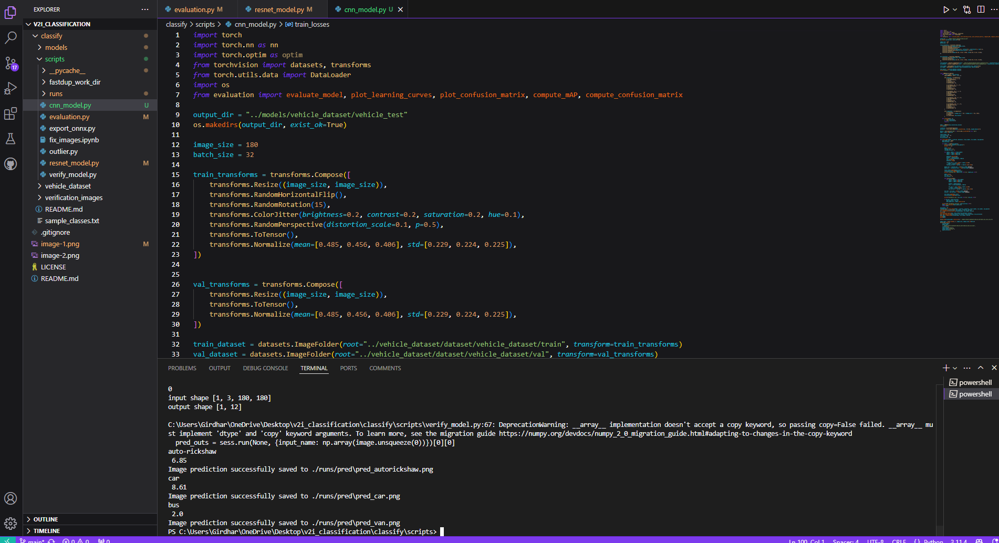
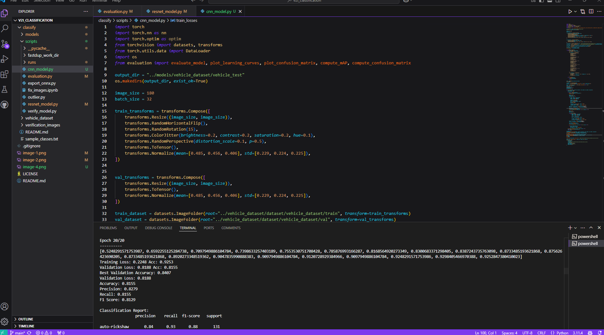

# Vehicle Detection Report

## Abstract
This report discusses the use of ResNet and CNN architectures for vehicle classification. ResNet achieved an accuracy of 80.28%, with strong precision, recall, and F1 scores, but misclassified vans as buses. CNN demonstrated slightly higher accuracy at 81.55%, performing well in detecting autorickshaws and cars but also struggled with van classification. The report elaborates on data cleaning, preprocessing, training, and the results obtained, along with proposed future work to enhance model performance.

**CNN Results**

---

---

**Resnet Results**

---

## Data Analysis and Cleaning
The dataset was analyzed using Fastdup to identify similar and outlier images. Issues such as imbalanced classes (e.g., fewer samples for mini-bus, rickshaw, tractor) were observed, which could lead to overfitting. Broken or corrupted images were removed. Additional balancing of the dataset, particularly for underrepresented classes, was identified as a necessary improvement to enhance model reliability.

---

## Data Preprocessing
Outliers and similar images were removed using Fastdup. Image size was resized to 180×180 pixels for uniformity, as specified in the training script. Mislabelled data in the truck class were detected and corrected using a ResNet-based script combined with CleanLab for automated outlier detection. Other classes had minimal mislabelling, simplifying preprocessing for those categories.

---

## Model Architecture

### ResNet (Pre-trained Model)
ResNet is a powerful CNN-based architecture leveraging residual connections to prevent gradient vanishing, making it suitable for transfer learning. Its pre-trained nature allows efficient tuning for specific tasks. ResNet was chosen for its strong generalization ability and minimal overfitting on this dataset.

### CNN
A custom CNN with five convolutional layers was employed. Each Conv2D layer was followed by batch normalization, dropout, ReLU activation, and max pooling. The layers were flattened and processed through fully connected layers for classification. CNN was selected for its effectiveness in image-related tasks and its ability to directly compare against ResNet.

---

## Training and Experimentation

### ResNet
ResNet exhibited less overfitting due to its pre-trained weights. The validation loss decreased from 1.7 to 0.75, with final training accuracy at 88.98%. A learning rate of 0.001 and weight decay of $10^{-4}$ were used to enhance generalization.

### CNN
CNN initially faced significant overfitting, with validation loss starting at 3.5 and ending at 1.089. To mitigate this, batch normalization, learning rate adjustments, and weight scheduling were applied. Training accuracy was 93.07%, with notable improvements in validation performance post-adjustments.

---

## Results and Key Findings

### ResNet Performance
- **Metrics**: Accuracy: **81.55%**, Precision: **82.87%**, Recall: **81.55%**, F1 Score: **81.29%**.
- **Confusion Matrix**:

Mini-bus exhibited reduced performance due to insufficient data, indicated by its high precision and F1 scores.

### CNN Performance
- **Metrics**: Accuracy: **80.28%**, Precision: **80.78%**, Recall: **80.28%**, F1 Score: **79.95%**.
- **Confusion Matrix**:

The tractor class demonstrated high precision and F1 scores due to its limited sample size.

---

## Future Work
To further improve the model:

1. **Dataset Enhancement**: Balance the dataset by augmenting underrepresented classes (e.g., mini-bus, rickshaw).
2. **Experiment with Other Architectures**: Implement MobileNet and VGG to evaluate their performance against ResNet and CNN.
3. **Advanced Data Augmentation**: Explore synthetic data generation to handle class imbalance.
4. **Fine-Tuning Strategies**: Experiment with different optimization techniques and learning rate schedules to improve model convergence.

---
